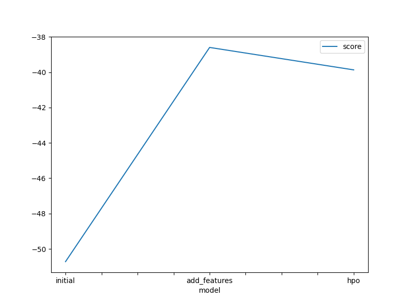
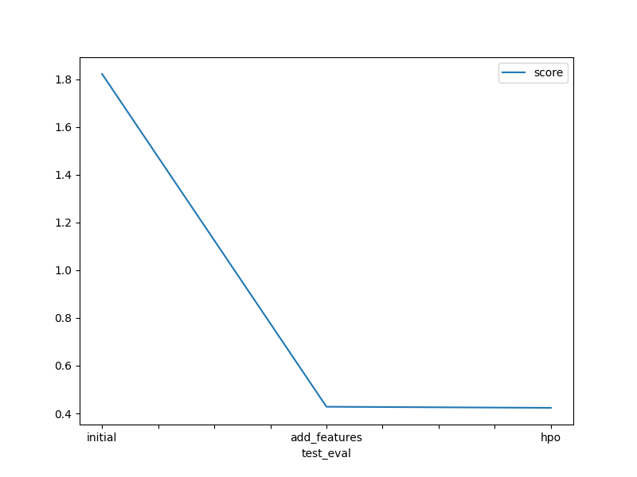

# Report: Predict Bike Sharing Demand with AutoGluon Solution
#### Haoran Yu

## Initial Training
### What did you realize when you tried to submit your predictions? What changes were needed to the output of the predictor to submit your results?
Negative predictions cannot be accepted. I make the negative predictions to be 0

### What was the top ranked model that performed?
WeightedEnsemble_L3

## Exploratory data analysis and feature creation
### What did the exploratory analysis find and how did you add additional features?
I found Season, holiday and weather are actually categorical features. I also extract monthm day, hour features from datetime to find seasonality diciplines. I also make more catogorical features based on numerical features. I make rush_morning, rush_noon,rush_evening based on hour; I make temp_cat (cold, mild, hot) based on temp; I make humidity_level (low_humidity, mid_humidity, high_humidity) based on humidity; I make too_windy (1, 0) based on windspeed.

### How much better did your model preform after adding additional features and why do you think that is?
The performance improves a lot. (from 1.82 to 0.42); After adding more features, more hidden rules are found.

## Hyper parameter tuning
### How much better did your model preform after trying different hyper parameters?
It improves from 0.4281 to 0.5235

### If you were given more time with this dataset, where do you think you would spend more time?
I will spend more time to try on each model seperately.

### Create a table with the models you ran, the hyperparameters modified, and the kaggle score.
|model|initial|add_features|hpo|
|--|--|--|--|
|time limit|600|600|600|
|presets|best quality|best quality|best quality|
|hp-method|None|None|XT:max_depth,n_estimators; RF:max_depth,n_estimators; FASTAI:num_epochs,learning rate,activation,dropout_prob,layers; XGB:eta, max_depth|
|score|1.82205|0.4281|0.4235|

### Create a line plot showing the top model score for the three (or more) training runs during the project.

### Create a line plot showing the top kaggle score for the three (or more) prediction submissions during the project.

## Summary
I found feature engineering is very important to improve result for this task.
